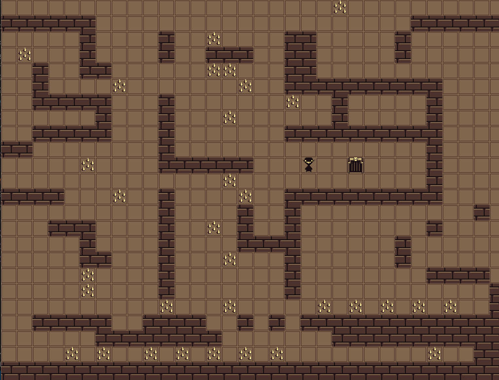
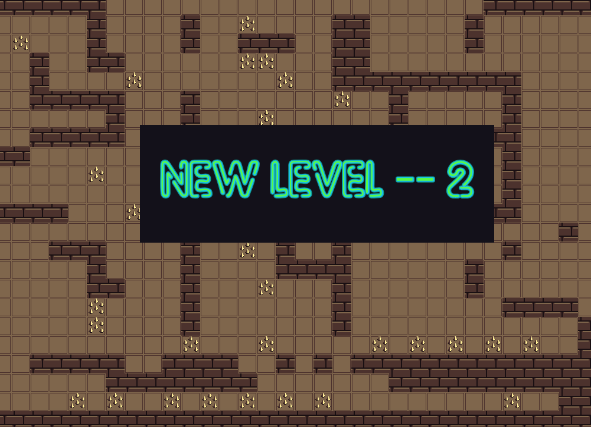
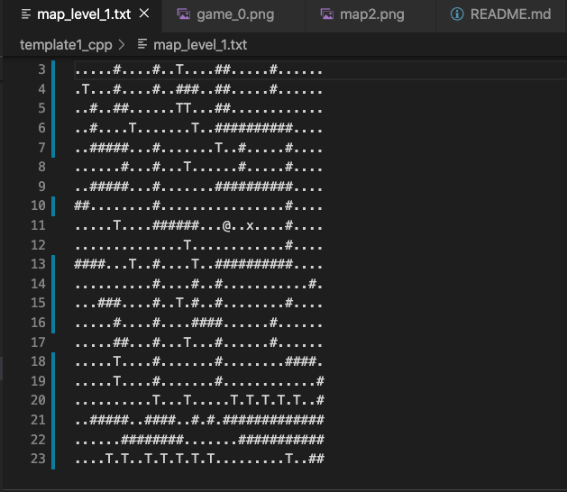
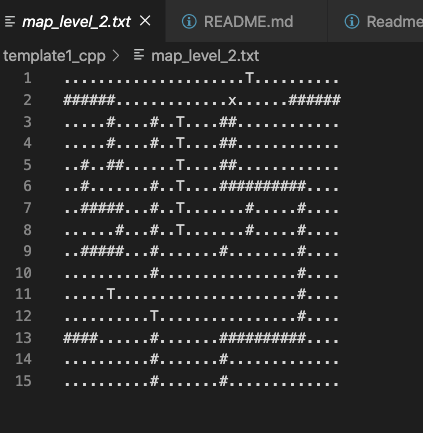
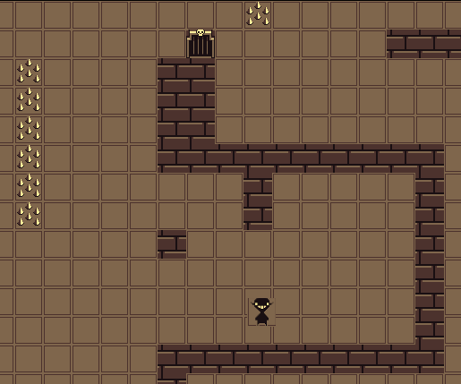

# GAME ROGUELIKE BY NINA

## ВАРИАНТ А1
​
​
1) Чтение карты лабиринта из текстового файла. Площадь карты должна составлять не менее 1600 тайлов, например, 80 Х 20 или 40 Х 40, и т.д., при этом доступное игроку пространство должно быть >=50% от этой площади (т.е. не должно быть практически пустых уровней)
​
​

2) (1 вариант) ловушки в полу (например, шипы, выскакивающие из-под пола): ‘T’

3) Визуализация карты при помощи графики с обязательным отображением всех игровых элементов разными изображениями (тайлами/спрайтами).
4) Реализация движения и взаимодействия с окружения игрока при помощи управления с клавиатуры (например, W, A, S, D, пробел). Игрок не должен проходить сквозь стены.
5) При попадании в пустоту/ловушку игрок должен умирать: с помощью графики необходимо вывести сообщение о проигрыше и завершить игру.
6) Если игрок достиг выхода с уровня, необходимо при помощи графики вывести сообщение о переходе на следующий уровень, либо об успешном окончании игры, если это был последний уровень.

Бонусная часть:
1)  постепенное “угасание” и появление игровой карты (fade out / fade in)